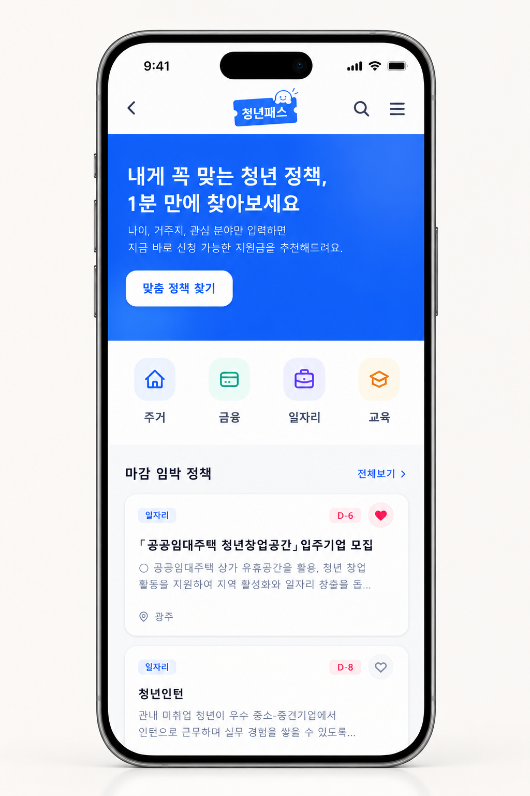
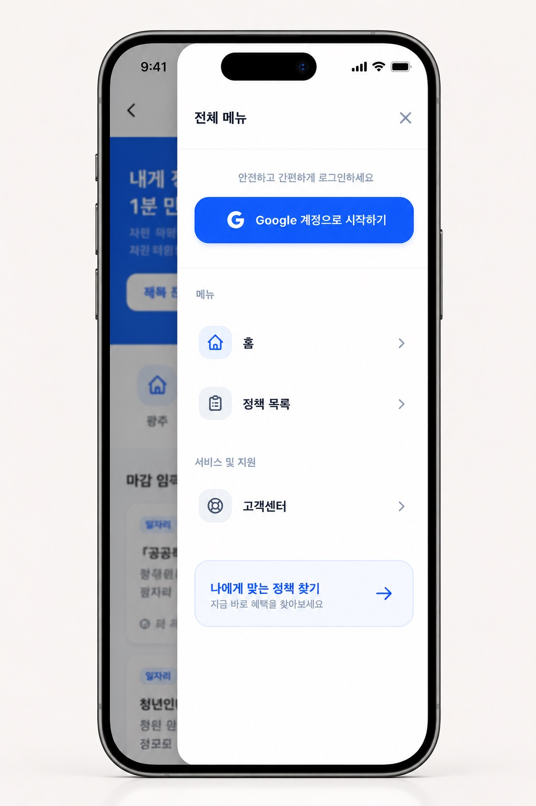
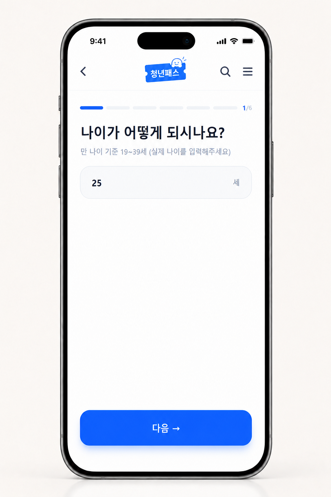
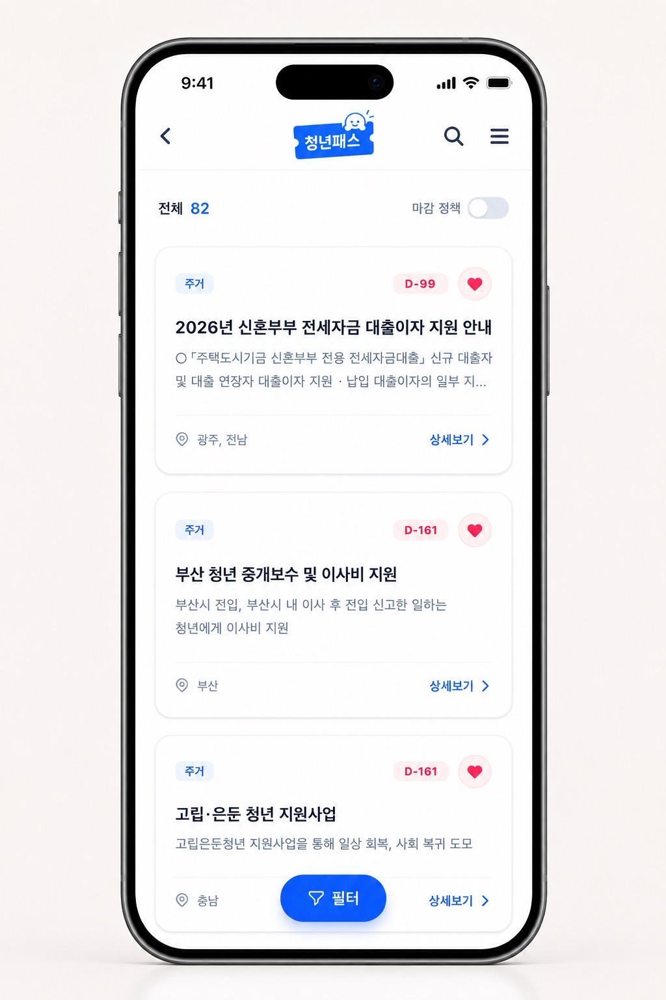
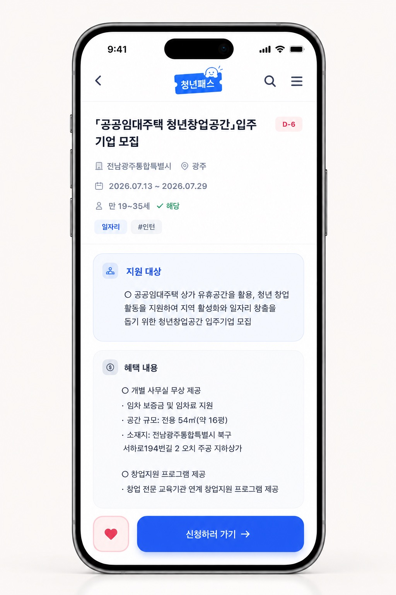
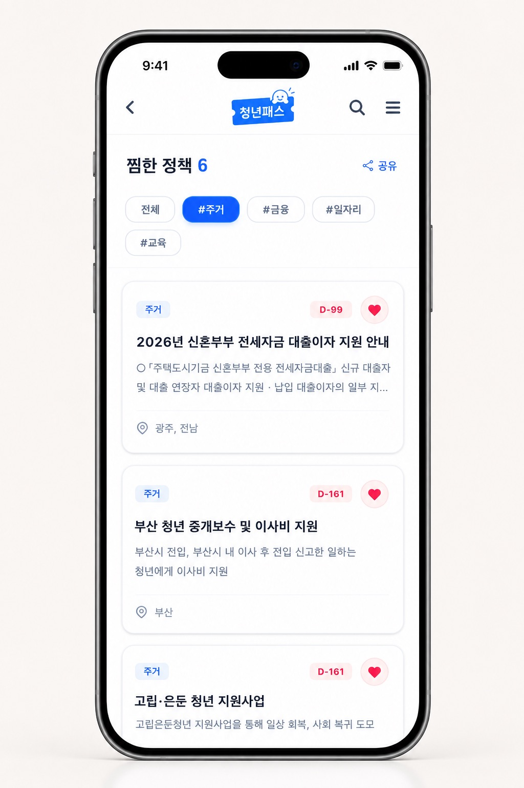
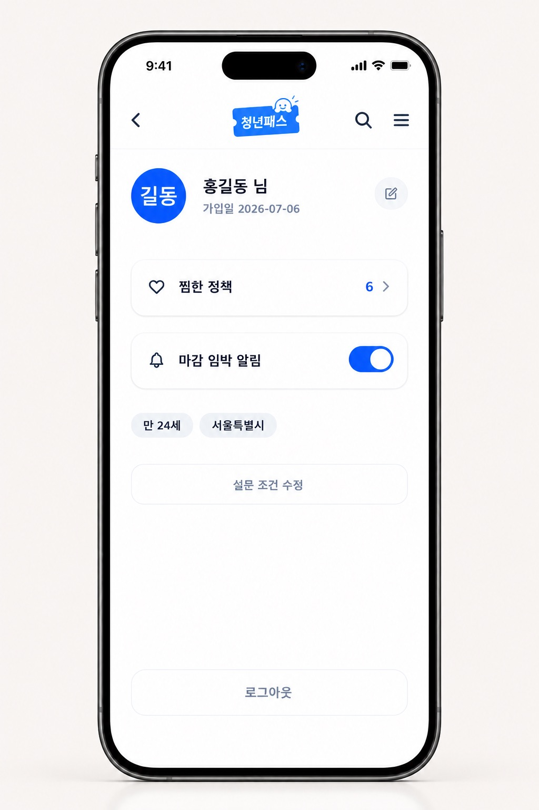
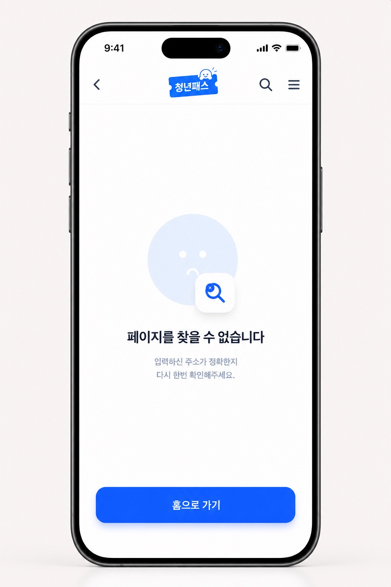
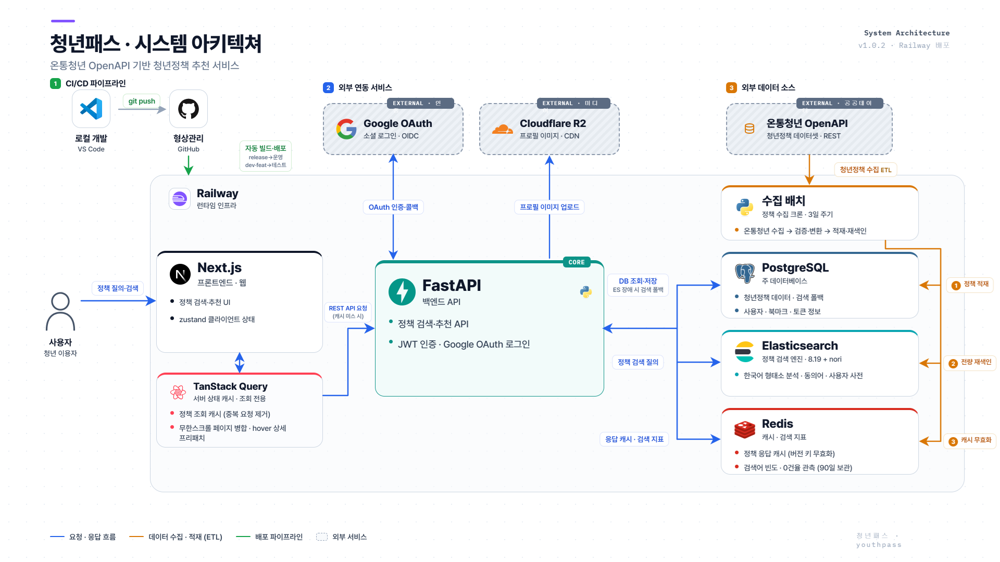
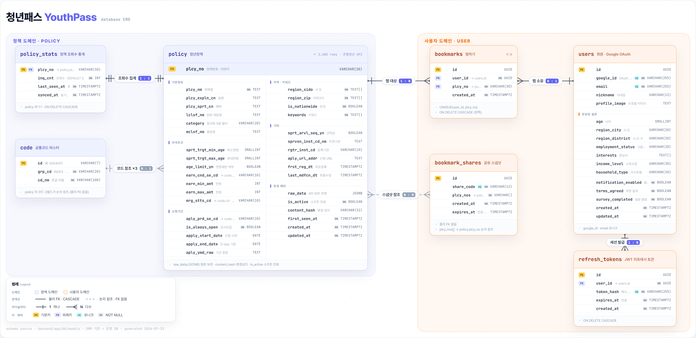

# 💰 청년패스 (YouthPass)

🌍 [청년패스 YOUTHPASS](https://www.youthpass.co.kr)

> 작업기간 : 2026. 06. 15 ~

## 📌 프로젝트 소개

### 기획 배경
> 흩어진 청년 지원 정책을 "내가 받을 수 있는 정책"만 골라 보여주는 정책 큐레이션 웹 서비스입니다.
>
> 매년 수천 건의 청년 정책이 나오지만, 정작 필요한 사람에게 닿지 않는 경우가 많습니다.

| 문제 | 설명 |
|---|---|
| 정보의 파편화 | 청년 정책이 각 지자체·중앙부처 사이트에 흩어져 있어 한 곳에서 찾아보기 어려움 |
| 복잡한 자격 조건 | 나이·소득·거주지·학력·취업상태 등 조건이 까다로워 본인이 대상인지 파악하기 어려움 |
| 혜택의 사각지대 | 제도를 모르거나 복잡한 공고문에 지쳐 신청 기한을 놓치는 정보 비대칭의 반복 |

기존 서비스에도 한계가 있습니다. 온통청년 같은 공공 플랫폼은 전국 정책을 모두 담고 있지만 정보가 과밀해 탐색이 어렵고, 민간 서비스는 보기 편하지만 다루는 정책 수가 적습니다. 청년패스는 이 간극에서 출발했습니다 — 공공 데이터의 전수성과 민간 서비스 수준의 UX를 함께 가져가는 것이 목표입니다.

### 서비스 방향

많은 정책을 보여주는 것보다, 받을 수 있는 정책만 정확히 보여주는 것에 집중합니다.

- 온통청년 OpenAPI에서 전국 청년정책 2,600여 건을 수집·정제해 자체 DB에 적재하고, 3일 주기로 자동 동기화
- 온보딩 설문(나이·거주지·취업 상태·관심 분야)을 기준으로 자격 조건에 맞는 정책만 필터링
- 지원대상·혜택·D-day를 카드 형태로 요약하고, 한국어 형태소 분석 기반 검색으로 탐색 시간 단축
- 정책 상세에서 신청 방법·서류·문의처를 정리해 제공하고 신청 URL로 바로 연결

주 타겟은 만 19~34세 청년이며, 초기에는 정책 정보가 가장 필요한 대학생·취업준비생·사회초년생에 집중합니다.

<br>

## 👥 팀 구성

| 조동희(PM) | 김찬영 | 정의나 |
|:---:|:---:|:---:|
|  |  |  |
| **Backend, Frontend** | **Backend** | **Frontend** |
| [@chodonghee-hub](https://github.com/chodonghee-hub) | [@chyoung001](https://github.com/chyoung001) | [@JEN023](https://github.com/JEN023) |

<br>

## 🧭 주요 기능

| 기능 | 설명 |
|---|---|
| Google 소셜 로그인 | Google OAuth 기반 회원가입/로그인, JWT 액세스·리프레시 토큰 발급 |
| 온보딩 설문 | 나이, 거주지, 취업 상태, 관심 분야, 소득 구간 등 입력 → 맞춤 정책 필터링에 활용 |
| 정책 목록/상세 | 카테고리별 정책 목록 조회, D-day·신청가능 여부 판정, 지원대상·신청방법 등 상세 정보 제공 |
| 정책 검색 | Elasticsearch(nori 형태소 분석) 기반 관련도 검색 + 자격요건 코드 8종(취업·학력·소득 등) 패싯 필터 |
| 맞춤 필터링 | 연령, 지역, 취업 상태, 관심 분야 등 조건으로 지원 가능한 정책만 분류 |
| 마이페이지 | 내 정보 조회/수정 |
| 북마크 | 관심 정책 저장 |
| 정책 자동 수집(ingest) | 온통청년 OpenAPI에서 정책 데이터를 수집·정제·검증 후 DB 적재하는 배치 파이프라인 (Railway Cron, 3일 주기) |

<br>

## 📱 화면 구성

| 홈 | 전체 메뉴 · 로그인 | 온보딩 설문 | 정책 목록 |
|:---:|:---:|:---:|:---:|
|  |  |  |  |

| 정책 상세 | 찜한 정책 | 마이페이지 | 404 |
|:---:|:---:|:---:|:---:|
|  |  |  |  |

<br>

## 🔗 시스템 아키텍처



<br>

## 💿 데이터베이스 설계



<br>

## ⚒️ Tech Stack


| 영역 | 기술 |
|---|---|
| Frontend | Next.js 16 (App Router), React 19, TypeScript, Tailwind CSS 4, Zustand, TanStack Query |
| Backend | Python, FastAPI, SQLAlchemy 2.0, Alembic |
| Database | PostgreSQL |
| Search | Elasticsearch 8.19 |
| Cache | Redis (응답 캐시) |
| 인증 | Google OAuth 2.0, JWT (python-jose), passlib(bcrypt) |
| 데이터 수집 | 온통청년 공공 API |
| Infra | Railway (FE/BE/DB/ES/Redis/Cron 통합 배포) |

<br>

## 📁 프로젝트 구조

```
YouthPass/
├── frontend/               # Next.js 프론트엔드
│   ├── app/
│   │   ├── features/       # 화면 단위 컴포넌트 (auth, home, policy, search, filter, bookmarks, mypage, location, gallery, errors)
│   │   ├── components/     # 공통 레이아웃 (MobileLayout 등)
│   │   └── (라우트 디렉터리) # auth, home, list, detail, filter, location, login, mypage, survey, search, bookmarks, 404
│   └── lib/                # 타입, 스토어(Zustand), API 클라이언트, 인증 유틸
│
├── backend/                # FastAPI 백엔드
│   ├── app/
│   │   ├── api/routes/     # 기능별 라우터 (auth, users, policy, health)
│   │   ├── core/           # 설정, 보안, OAuth, Redis/ES 커넥션, 캐시
│   │   ├── db/models/      # SQLAlchemy ORM 모델 (User, Policy, Bookmark, Code, PolicyStats, RefreshToken)
│   │   └── schemas/        # Pydantic 스키마
│   ├── ingest/             # 온통청년 API 수집·정제·검증·적재 파이프라인 (CLI)
│   ├── elasticsearch/      # ES 커스텀 이미지 (nori 플러그인 포함 Dockerfile)
│   └── alembic/            # DB 마이그레이션
│
├── public/asset/           # README 등 문서용 이미지
│   ├── screens/            # 서비스 화면 스크린샷
│   ├── diagrams/           # 아키텍처 다이어그램, ERD
│   ├── icon/               # 서비스 아이콘
│   └── Team/               # 팀원 프로필 이미지
├── PRD/                    # 기획 문서
└── workflow/               # 작업 기록 (이슈/브랜치별 작업 계획·결과 문서)
```

<br>

## 🔌 API 엔드포인트

API 경로는 `/api/{기능}/{메서드}/{상세}` 규칙을 따릅니다.

| 메서드 | 경로 | 설명 |
|---|---|---|
| GET | `/api/health/get/status` | 서버 상태 확인 |
| GET | `/api/auth/get/google-login` | Google 로그인 리다이렉트 |
| GET | `/api/auth/get/google-callback` | Google OAuth 콜백 |
| POST | `/api/auth/post/refresh` | 액세스 토큰 갱신 |
| POST | `/api/auth/post/logout` | 로그아웃 |
| GET | `/api/users/get/me` | 내 정보 조회 |
| PUT | `/api/users/put/me` | 내 정보 수정 |
| POST | `/api/users/post/survey` | 온보딩 설문 제출 |
| GET | `/api/policy/get/policies` | 정책 목록 조회 (필터·검색어·정렬 포함) |
| GET | `/api/policy/get/search` | 정책 검색 (자격요건 코드 패싯 필터 + 검색어) |
| GET | `/api/policy/get/policy/{policy_id}` | 정책 상세 조회 |

<br>

## 🔖 커밋 컨벤션

| 타입 | 설명 |
|---|---|
| `feat` | 새로운 기능 추가 |
| `fix` | 버그 수정 |
| `style` | UI 관련 변경 |
| `refactor` | 코드 구조 개선 (기능 변경 없음) |
| `perf` | 성능 개선 |
| `test` | 테스트 코드 추가/수정 |
| `docs` | 문서 변경 |
| `chore` | 빌드, 패키지 등 기타 작업 |
| `revert` | 이전 커밋 되돌리기 |
| `init` | 프로젝트 초기 설정 |
| `delete` | 코드/파일 삭제 |
| `wip` | 작업 중/실험적 변경 |

<br>

## 🚀 로컬 실행 방법

**Frontend**
```bash
cd frontend
cp .env.example .env.local
npm install
npm run dev        # http://localhost:3000
```

**Backend**
```bash
cd backend
cp .env.example .env   # 실제 DB/OAuth 정보로 수정 필요
./venv/Scripts/activate   # Windows
source venv/bin/activate  # Mac/Linux
pip install -r requirements.txt
alembic upgrade head
uvicorn app.main:app --reload   # http://localhost:8000
```

**HTTPS로 로컬 접속하려면 (`https://localhost:3000`)**
```bash
# frontend/.env: NEXT_PUBLIC_API_URL, GOOGLE_REDIRECT_URI를 https://localhost:... 로 설정
# backend/.env: ALLOWED_ORIGINS, GOOGLE_REDIRECT_URI, FRONTEND_URL을 https://localhost:... 로 설정
# Google Cloud Console 승인된 리디렉션 URI에 https://localhost:8000/api/auth/get/google-callback 추가 필요

cd frontend
npm run dev:https   # mkcert 자체 서명 인증서로 https://localhost:3000 서빙

cd backend
# 최초 1회: backend/certs/ 에 localhost용 자체 서명 인증서 생성
mkdir -p certs && cd certs
openssl req -x509 -nodes -newkey rsa:2048 -keyout localhost-key.pem -out localhost.pem \
  -days 825 -subj "/CN=localhost" -addext "subjectAltName=DNS:localhost,IP:127.0.0.1"
cd ..
uvicorn app.main:app --reload --ssl-keyfile certs/localhost-key.pem --ssl-certfile certs/localhost.pem
```

**정책 데이터 수집 (ingest)**
```bash
cd backend
python -m ingest.run verify --limit 300   # 수집·정제·검증만 (DB 미적재)
python -m ingest.run dryrun               # 적재 시뮬레이션 (ROLLBACK)
python -m ingest.run load                 # 실제 DB 적재 (성공 시 ES 재색인·캐시 무효화 자동 연쇄)
python -m ingest.run reindex              # ES 전량 재색인만 단독 실행
```

<br>
